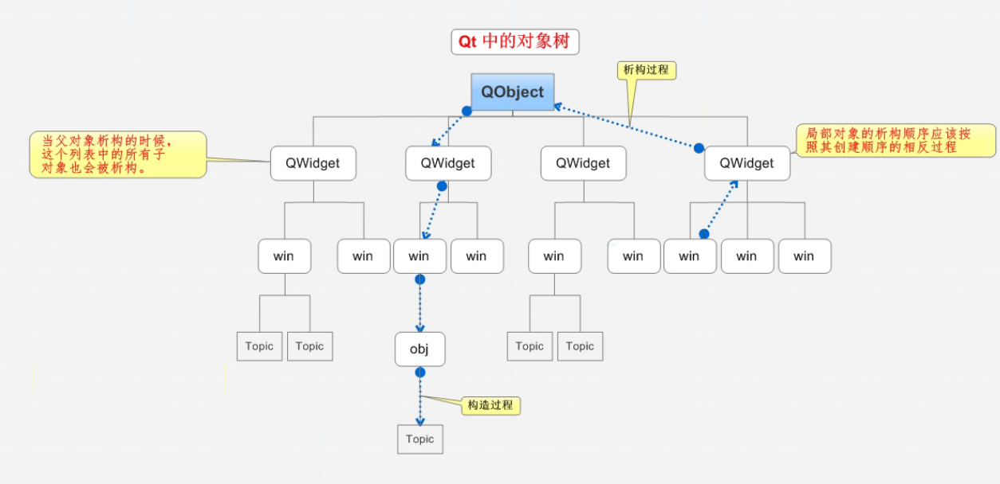

# 基础

- QApplication：应用程序类，有且只有一个

- QWidget：父类，空窗口
- QMainWindow：子类，主窗口，拥有菜单栏、工具栏
- QDialog：子类，对话框


## ==对象树==



在Qt中，所有控件类都继承自QObject，因此QObject是最低层的父类

- QObject是以对象树的形式组织起来的
  - 当创建一个QObject对象时，会看到QObject的构造函数接收一个QObject指针作为参数，这个参数就是 parent，也就是父对象指针。这相当于，**在创建QObject对象时，可以提供一个其父对象，我们创建的这个QObject对象会自动添加到其父对象的children()列表。**
  - **当父对象析构的时候，这个children()列表中的所有对象也会被析构。（注意，这里的父对象并不是继承意义上的父类！）**这种机制在 GUI 程序设计中相当有用。例如，一个按钮有一个QShortcut（快捷键）对象作为其子对象。当我们删除按钮的时候，这个快捷键理应被删除。


==引入对象树的概念，在一定程度上解决了内存释放问题：==

- 当一个QObject对象在堆上创建的时候，Qt 会同时为其创建一个对象树。不过，对象树中对象的顺序是没有定义的。这意味着，销毁这些对象的顺序也是未定义的。
- 任何对象树中的 QObject对象 delete 的时候，如果这个对象有 parent，则自动将其从 parent 的children()列表中删除；如果有孩子，则自动 delete 每一个孩子。Qt 保证没有QObject会被 delete 两次，这是由析构顺序决定的。


## QWidget 主窗口

QWidget是能够在屏幕上显示一切组件的父类，继承自QObject，因此也继承了对象树关系。

如，在QWdiget窗口中绘制了一个工具栏控件，那么这个工具栏控件就添加到了QWdiget的children()列表中，当删除了工具栏，就从children()列表中移除掉

> 实例

在**构造函数**中设置窗口的一些属性

```c++
myWidget::myWidget(QWidget *parent)
    : QWidget(parent)
{
    //重置窗口大小
    resize(600, 400);
    //设置窗口标题
    setWindowTitle("FirstProject");
    //设置固定窗口大小
    setFixedSize(600, 400);
}
```


## 坐标系

坐标体系：以左上角为原点（0,0），X向右增加，Y向下增加


对于嵌套窗口，其坐标是**相对于父窗口**来说的。


## ==信号和槽==

在帮助文档搜索QPushButton的Signal查看相关API

**点击按钮后，窗口关闭**需要使用以下参数进行**连接（connect）**：

- 信号发送者（对象）：按钮
- 发送的信号（函数地址）：点击（clicked）
- 信号接受者（对象）：窗口
- 信号的处理（函数地址）：关闭函数（槽函数）

```c++
//连接信号：点击button3，关闭当前窗口
connect(button3, &QPushButton::clicked, this, &myWidget::close);
```

**松散耦合：信号的发送者和接受者是不相关的，经过connect进行连接后，可以进行信号传输**


### 自定义信号和槽函数

- 信号signals：返回类型void，只需要声明，不需要实现，可以有参数，可以重载
- 槽函数：返回类型void，需要声明和实现，可以有参数，可以重载
- 触发自定义信号：emit

```c++
//设置两个类，Teacher类和Student类，两个类在创建时都继承QObject基类
//要求：Teacher类发送一个下课的信号，Student类响应该信号，并执行吃饭的槽函数
class Teacher : public QObject
{
    Q_OBJECT
public:
    explicit Teacher(QObject *parent = nullptr);

signals: //自定义信号，写到signals下
    //返回值是void，只需要声明，不需要实现，可以有参数，可以重载
    void take_break();
    void take_break(QString name);	//信号发送时，携带name参数
};
/**************************************************************/
class Student : public QObject
{
    Q_OBJECT
public:
    explicit Student(QObject *parent = nullptr);
    //定义槽函数（信号处理函数）
    //返回void，需要声明和实现，可以有参数，可以重载
    void eat()
    {
        qDebug() << "下课吃饭"; //响应时，打印这句话
    }
    void eat(QString name)	//槽函数接收携带name参数的信号，并进行响应
    {
        qDebug() << name << "下课吃饭";
    }
};
/**************************************************************/
//在主窗口构造函数中连接信号和槽，并触发信号
Widget::Widget(QWidget *parent): QWidget(parent)
{
    //创建Teacher对象
     this->teacher = new Teacher(this);
    //创建Student对象
     this->student = new Student(this);
    //连接信号和槽：当触发take_break时，自动调用槽函数eat
    connect(teacher, &Teacher::take_break, student, &Student::eat);
    
    //点击按钮触发take_break信号
    QPushButton *btn = new QPushButton;
    btn->setParent(this);
    btn->setText("下课");
    //点击按钮触发take_break信号
    connect(btn, &QPushButton::clicked, this, &Widget::emitSignal);
}

void Widget::emitSignal()
{
    emit teacher->take_break("小王");
}
```

==注意：==

- 代码顺序有先后，**必须先连接信号和槽，再触发信号**
- 连接==重载==的信号和槽时，需要使用函数指针来获得函数的地址：

```c++
//设置带参的信号和槽，使用函数指针获得重载函数的地址
void(Teacher::*teacherSignal)(QString) = &Teacher::take_break;//成员函数的函数指针需要加上作用域
void(Student::*sutdentSlot)(QString) = &Student::eat;
connect(teacher, teacherSignal, student, sutdentSlot);
```

- ==信号连接信号==

```c++
//设置无参的信号和槽，使用函数指针获得重载函数的地址
void(Teacher::*teacherSignal2)(void) = &Teacher::take_break;
void(Student::*sutdentSlot2)(void) = &Student::eat;
connect(teacher, teacherSignal2, student, sutdentSlot2);
QPushButton *btn2 = new QPushButton;
btn2->setParent(this);
btn2->setText("void下课");
//点击信号连接下课信号
connect(btn2, &QPushButton::clicked, teacher, teacherSignal2);
```

- 槽函数为匿名函数

```c++
QPushButton *btn2 = new QPushButton;
btn2->setText("关闭");
btn2->move(0,60);
btn2->setParent(this);
connect(btn2, &QPushButton::clicked, this, [this](){this->close();});
```


### 断开连接

```c++
disconnect() //参数与connect一致
```

### 拓展

- 信号和槽函数的参数，信号参数个数可以多余槽函数参数个数，参数类型必须一一对应，

- 信号可以连接信号
- 一个信号可以连接多个槽函数
- 多个信号可以连接同一个槽函数


## QString类型

QString是Qt自带的字符串类型，可以与char类型互转

```c++
//QString转为char *
QString name;
char *name_c = name.toUtf8().data();
```


# 控件

可以使用帮助文档查看控件的使用

## 主窗口 QMainWindow


包含以下部件：

- 菜单栏Menu Bar
- 工具栏Tool Bar Area
- 铆接窗口部件Dock Widget Area
- 中心窗口部件Central Widget
- 状态栏Status Bar

### 菜单栏 QMenuBar

### 工具栏 QToolBar

### 状态栏 QStatusBar


### 铆接部件 QDockWidget

### 中心部件 QTextEdit

## 对话框 QDialog


## 按钮 QPushButton

==头文件：==`#include<QPushButton>`

|                       API                        |                    描述                    |
| :----------------------------------------------: | :----------------------------------------: |
| QPushButton *btn = new QPushButton("text", this) | 初始化构造，设置按钮文本，并在当前窗口显示 |
|               btn->setParent(this)               |                 设置父窗口                 |
|               btn->setText("text")               |                设置按钮文本                |
|                 btn->move(x, y)                  |                  定位按钮                  |

> 实例

在要显示的窗口的**构造函数**中定义按钮，并设置一些属性

```c++
#include "mywidget.h"
#include<QPushButton>
myWidget::myWidget(QWidget *parent)
    : QWidget(parent)
{
    //创建一个按钮
    QPushButton *button1 = new QPushButton;
    //button1->show();    //show()以顶层的方式显示窗口
    //让button1放置在窗口中
    button1->setParent(this);
    //设置button1的文本
    button1->setText("ok");

    //按照按钮大小创建窗口
    QPushButton *button2 = new QPushButton("cancel", this);

    //移动button2按钮
    button2->move(0, 20);
}
```

