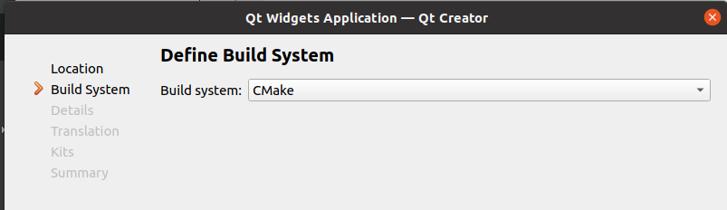

# 环境配置

- g++
- CMake

# 安装Qt

Qt下载地址：http://download.qt.io/archive/qt/

- 1、选择一个版本Linux版本进行下载


- 2、下载好赋予可执行权限

```c++
chmod +x qt-opensource-linux-x64-5.12.10.run
```

- 3、执行安装命令

```c++
sudo ./qt-opensource-linux-x64-5.12.10.run
```

- 4、进入安装界面，默认选择下一步直到安装完成
- 5、配置路径：如果没有对应的文件就先创建

```c++
sudo gedit /usr/lib/x86_64-linux-gnu/qt-default/qtchooser/default.conf
```

- 6、修改`default.conf`的内容

```shell
/opt/Qt5.12.10/5.12.10/gcc_64/bin
/opt/Qt5.12.10/
```

- 6、进入到程序文件夹下运行Qt，可以写一个脚本运行

```shell
#!/bin/bash
cd /opt/Qt5.12.10/Tools/QtCreator/bin 
./qtcreator
```


# 创建项目

- 1、选择桌面应用


- 2、编译器选择CMake



- 3、根据需求选择要生成的程序架构


- 4、main.cpp


# 常用快捷键

- 注释：CTRL+/
- 运行：CTRL+R
- 编译：CTRL+B
- 查找：CTRL+F
- 整行移动：CTRL+SHIFLT+↑/↓
- 自动对齐：CTRL+I
- 同名之间的`.h`和`.cpp`的切换：F4
- 帮助文档：
  - 方法一：鼠标移动到指定变量再按F1
  - 方法二：打开帮助文档


